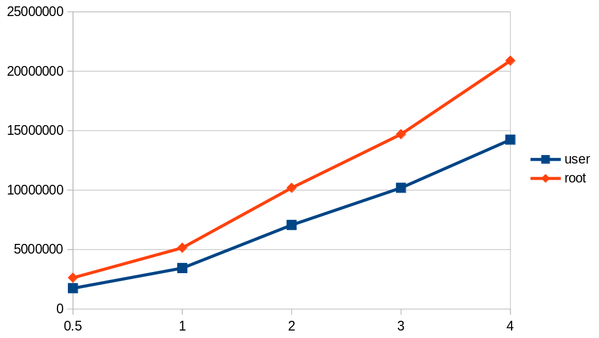

# CASO: LAB2

**1. Feu una taula amb els temps d'execució que obteniu. Per què els temps d'execució són tandiferents?**

|SYSCALL|sbrk(0)|sbrk(inc)|sched_yiel()|getpid()|fork/waitpid|
|:-:|:-:|:-:|:-:|:-:|:-:|
|Execution time(us)|1|151|176|134|41870|

**2. Podeu comprovar d'alguna manera que els programes executen realment la crida a sistema? (I noaprofiten el resultat retornat per la crida anterior)**

Nosaltres hem fet servir la opcio -O0 que garateix que no es es faran optimitzacions el la compilacio del nostre code, pel que estem segurs que el nostre codi compilat no esta fent cap optimització.

En canvia la cira a sistema no es compilada ni implementada per nosaltres, pel que no tenim cap seugiretat que es guardi el resultat de la crida anterior. Aixo es pot comprovar fent us d'un debugger y observer el comportament de la crida.

**3.A la darrera transparència del tema Virtualització-Sincronització-MesuresdeRendiment (transp. 50)us demanem que feu un programa que escrigui al disc 500MBytes, mesurant el temps que triga afer-ho. Des d'un usuari no privilegiat (no root), executeu el vostre programa sobre un fitxer en el disc de la màquina que feu servir per aquest laboratori. Per exemple, podeu fer-ho sobre un fitxer enel directori /tmp. Si teniu dues versions del codi, una desenvolupada per cada membre del grup:**

[writeOnDisk.c](writeOnDisk.c)

**4. Modifiqueu   el(s)   programa(es)   per   poder   canviar   la   mida   de   les   dades   escrites   al   disc.   Un   copexecutat(s) amb les diferents mides, per exemple (0.5, 1, 2, 4 Gbytes, si teniu espai al disc), feu unagràfica amb els resultats que obteniu de bandwidth. A l'eix de les X situeu el tamany de les dadestransmeses i a l'eix de les Y, el bandwidth. Podeu usar LibreOffice scalc, el GNU plot, el jgraph... icomparar els resultats que obteniu amb el vostre company de laboratori.**

0.500000GB: 123941070 - 122197832 = 1743238us | BW = 0.2868 GB/s

1.000000GB: 127381697 - 123941102 = 3440595us | BW = 0.2906 GB/s

2.000000GB: 134445890 - 127381710 = 7064180us | BW = 0.2831 GB/s

3.000000GB: 144635254 - 134445902 = 10189352us | BW = 0.2944 GB/s

4.000000GB: 158870605 - 144635265 = 14235340us | BW = 0.281 GB/s

**5. Si executeu el programa com a administradors (root), obteniu alguna diferència en elsresultats?**

0.500000GB: 1221794916 - 1219168865 = 2626051us | BW = 0.1904 GB/s

1.000000GB: 1226942045 - 1221794955 = 5147090us | BW = 0.1943 GB/s

2.000000GB: 1237131855 - 1226942059 = 10189796us | BW = 0.1963 GB/s

3.000000GB: 1251831462 - 1237131871 = 14699591us | BW = 0.2041 GB/s

4.000000GB: 1272716397 - 1251831482 = 20884915us | BW = 0.1915 GB/s

