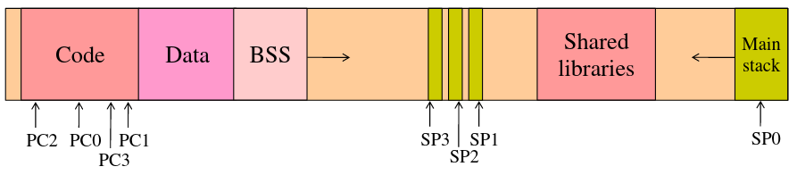

# CASO

## Theory

### Theme 1

#### Operating System
Is a set of softwares that manages computer hardware, software resources and provides common services for computer programs. It also provides you a execution environment to execute your software conveniently and efficiently. In addition, OS provides protection to the user.

#### Process
The process is the unit of resource assignation. It is composed by one addresses space, communication channels and execution threads.

##### Address space
A virtual address space it's a region of the virtual memory that contains the code, data and BSS and the stack.

With threads, the general structure of an address space is: 

- Main stack only grows though a limit (Example: 8Mb)
- Stacks form other threads only grows when a SIGSEGV is attended.
- The address space can be inspected using ps, top or htop or you can view de memory mapping of a process at /proc/\<pid\>/maps. See also "ldd".

#### Thread

Is the smallest sequence of programmed instructions that can be managed independently by a scheduler. 

A thread is composed by:
- PC + SP (minimum)
- Control register/flags
- Integers
- Floating point numbers
- [Multimedia extensions](https://www.youtube.com/watch?v=DexYsSvXDjQ&t=)
- [SIMD extensions](https://ca.wikipedia.org/wiki/SIMD) 

##### Properties
- Priority
- Quantum -> Maximum amount of time between the begin of running time and the moment that the OS considers changing context.

##### Threads offered by OS interface
- Caution -> clock interruptions
- Can be assigned to a core

##### Threads offered by system
- Shares all resources
- Can demand resources for the process
- Can release resources
- Must be synchronized access to shared data and shared resources

#### Levels of threads

##### Hybrid environment
- Managed by pthreads
    

---

## Activities

### 1. Com vendre un sistema operatiu a el de econòmiques.

Es necessari adquirir un sistema operatiu pels ordinadors pel fet que el programa X que es fa servir a diarí, i tot i que sigui l'únic que es fa servir en la nostre meravellosa empresa, no podem fer-lo funcionar sense una base. I sí, d'acord, es podria fer corre sense aquesta base, però hem de parlar amb l'empresa (i pagar-la) perquè faci que el seu programa funcioni sense, per exemple, Windows. Calculo que serien un quants millors que ens facin aquest projecte.

En canvi si comprem el sistema operatiu Windows ens constara al voltant de (un preu que no se), que a part del sistema en si també ve inclòs en el preu suport tècnic, aixo ens facilitara tant l'ús de la tant preuada eina en la que es basa tota la nostra empresa com que si mai tenim algun problema poder contactar, sense costa addicional, el servei tècnic de Microsoft. També amb ajuda d'altres eines podem controlar l'activitat i la productivitat d'alguns, _no de tots ja saps ;)_, i portar un control de l'eficiència del nostre personal. 